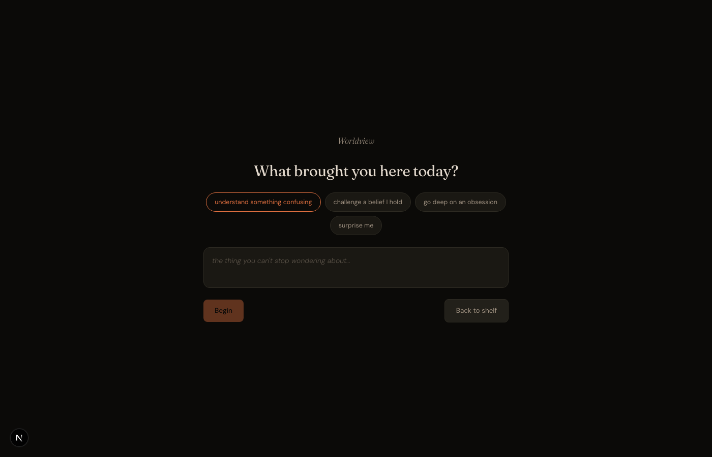
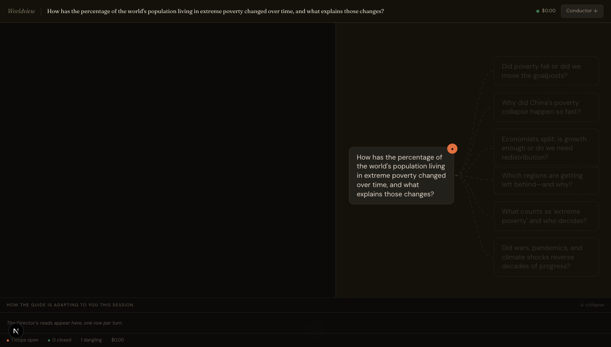
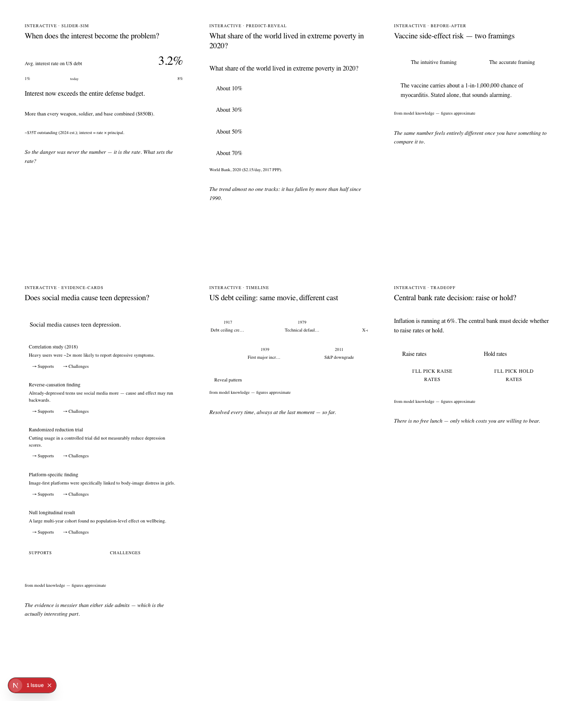

# Worldview

> Bring a question that's been nagging you; leave actually understanding it — with a map of how your thinking got there. Keep coming back and it becomes a map of what you think.

Worldview is a single-screen product where one held question becomes a guided session that actually lands, and persists. A directed AI guide works your question in loops instead of answering and stopping; a live map on the right remembers everything so the thread is still there tomorrow. This README is the product overview — the problem it's aimed at, the bet behind it, how it works, and how it's built. The full spec lives in [`docs/`](docs/).

---

## The problem

**Who it's for — the off-hours wonderer.** Intellectually restless, mid-20s to 40s, the kind of person who gets a question stuck in their head at 11pm. Why everyone suddenly cares about the national debt. Why planes are slower than they were in 1970. Whether the thing an uncle said at dinner is actually true.

**What they do today.** Open a tab. Then a YouTube video, a Reddit thread, a Wikipedia page that assumes you already know the thing you opened it to learn. Forty minutes later: nine tabs, roughly the understanding you started with, and the moment the laptop closes the whole thread evaporates.

**Why a chatbot doesn't close the gap.** It answers the question and stops. Staying curious is back on you, and tomorrow the conversation is gone. The spiral and the chatbot fail the same way — neither is built to keep a thread alive, and neither leaves anything behind. That's the gap: not a shortage of answers, a shortage of *follow-through* and *memory*.



## What I'm building, and the bet

The core move is to treat your question as the *start* of a thread, and engineer every payoff to open the next one. Concretely, that's a different contract than a chatbot makes:

| A chatbot | Worldview |
|---|---|
| Answers, then waits | Treats your question as the start of a thread; every payoff is built to open the next hook |
| One register for everyone | A Director adapts the guide per turn to how *you're* responding — challenge when you're coasting, land the payoff when you're close |
| Text in, text out | Delivers the "click" as an interactive when that lands better than prose |
| Conversation evaporates | Your understanding persists as a map — unchanged and waiting, still growing, when you return |

**The vision, and the honest scope of it.** Curiosity is the honest way into someone's thinking — you can't market your way into a person's beliefs, but a question they can't put down walks them there. So v1 sells the curiosity. The layer that turns clicks into an actual *view you hold* — a before/after on what you thought, a once-a-session "so what do you think now?", a "Where you stand" line that remembers — rides along deliberately thin. It costs nothing, it's never the pitch, and it earns more investment only if people actually use it. The name is where the product is going; curiosity is how it gets there.

**The bet, written down before I built it.** The honest version of "is this worth making" is: *one great session on a question you actually hold, often enough that you come back without being nagged.* I wrote the pass/fail threshold down first so I can't grade on a curve later — it's in [`docs/PRD.md`](docs/PRD.md) §10 and summarized under [What I measure](#what-i-measure) below.

## How it works

One screen, two panes. On the left, a conversation with a single guide. On the right, a map of your thinking that grows as you talk — questions and ideas, not a syllabus. Open loops glow like embers; settled ones go quiet. Come back tomorrow and the map is exactly where you left it.

Behind the guide is a **Director** that makes one decision every turn: how to serve *you*, right now. Explain when you're building, challenge when you're coasting, go a layer deeper, change the angle, or hand you the payoff as something you can drag instead of read. It reads two things — how engaged you are, and how close you are to the "ohhh" — and picks its move.

Two rules it never breaks:

- **It won't hand you the answer.** A thread only settles when *you* say the insight back in your own words, because you can't really own a view you were handed. The guide names this rule once, lightly, in its first reply — so the contract is a wink, not friction you discover later.
- **It won't trade truth for a hook.** If the honest answer kills a great setup, the setup dies. That floor lives in the guide's system prompt where no per-turn Director instruction can reach it.



Sometimes the click is better felt than read — a slider where you watch interest payments cross the defense budget as you drag the rate, a predict-then-reveal that catches your wrong intuition in the act. These are real interactive components from a fixed library of templates, filled per-moment for the exact question you're on. They deliver a click or open a loop, and they never block the conversation.



### A turn, concretely

User picks *understand something confusing* and types *"I don't get why everyone's freaking out about the national debt."* Onboarding sharpens it to *"Is the US national debt actually dangerous — and how would we know?"* and the map seeds in the background.

- **Turn 1** — cold start. The guide opens a loop instead of lecturing: *"serious people have predicted a US debt crisis since 1981 and been wrong for forty years straight — either they're all fools or they're early. Which way are you leaning, gut-level?"* The lean you state becomes the *before* on the map.
- **Turn 5** — you say "ok but that just sounds like it's fine forever, which can't be right." The Reader flags *leaning in, near a click*. The Director switches the guide to **challenge** and spawns a **slider** — drag the interest rate, watch interest payments cross defense spending. You sit with it: **click.** The loop settles, and the artifact's closing line opens the next one: *"so the danger isn't the debt — it's the rate. What sets the rate?"*
- **Turn 8** — replies shorten, latency climbs. The Director reads *restless, far*, releases the thread, and offers the map's most provocative frontier node instead.

Every one of those moves is logged with its rationale in the **Conductor pane** — which is also the eval instrument (below).

## What I measure

**Not minutes — clicks.** Session length is a bad proxy for the feeling this sells: a confused person produces a long session, a delighted one might produce a short one. The metric is the **click** — a loop closed in a way that opens the next loop — and the quality multiplier is whether that next loop actually got pursued (net of the Director's own branches, which don't count as chains).

This also kills the obvious failure mode by construction. Optimize for time-on-app and you build something that strings people along; optimize for resolved curiosity and you build something that resolves curiosity.

**The Director's reasoning is the eval surface, not a black box.** Every move is logged and shown in the Conductor pane, one row per turn, each with a quiet 👍/👎 — *did the guide read you right?* That's there for trust (nothing you can't see is steering you), and it doubles as the instrument I use to grade the Reader. Post-build, ~50 real exchanges get hand-labeled against what the Director thought you were doing, and the Reader's agreement rate gets published here — so the north star isn't self-graded homework.

**The pre-registered kill test.** Ten friends, real questions they actually hold, no notifications and no reminders. Desktop only — a friend opening a texted link on a phone would be measuring mobile polish, not the curiosity hypothesis.

> **4 or more return on their own within a week → the multi-session bet lives. 2 or fewer → it's dead.** 3 means the sample's too small to call and I extend it.

The thresholds are honest about n≈10 (a percentage would be false precision) and about the goodwill bias (friends return partly to be nice) — both written down here so I can't rationalize the result after the fact. A second question rides along: do returners ever read or update "Where you stand"? If they ignore it, the view layer stays a side effect and earns no more investment.

## Architecture

Server and client are one Next.js process — not serverless, because the turn's response streams to you while the map fills in behind it, and you never wait on that generation.

**Three agents, one voice:**

- **Director** — the product. Each turn it reads appetite (leaning in vs. restless) × proximity to a click, consults what it knows about you, and picks 1–2 moves from a four-tool catalog: set the guide's mode, grow the map, spawn an artifact, raise caution. Across sessions it maintains a persistent **user model** (what modes land, your pacing, your interests) — that model is the moat this repo demonstrates.
- **Tutor** — the one voice. Sonnet-class. Embodies the Director's instruction without narrating it, and emits a loop-state read (is a payoff close? did one just land?) that feeds the next decision.
- **Generator** — the world-builder. Haiku-class, async. Grows map nodes and fills artifact templates for the specific loop it's serving. Nothing it does ever delays a reply.

| Piece | Where |
|---|---|
| Per-turn pipeline (Reader → Director → guide, async map/artifact generation, post-hoc safety + accuracy check) | `src/lib/pipeline.ts` |
| One module every model call routes through (the mock seam lives here too) | `src/lib/llm.ts` |
| The prompts — which are most of the actual product | `src/lib/prompts.ts` |
| Six interactive templates + their schemas | `src/templates/` |
| The map (React Flow), chat, Conductor, shelf | `src/components/` |
| Data model (Prisma / SQLite) | `prisma/schema.prisma` |

**Two decisions worth calling out.** The guide adapts per turn, but the duty-of-care floor lives in its system prompt where no Director instruction can reach it. And the Director's per-decision log is structured as a training set from day one — there's no learned policy in v1 (ten users would never train one, and pretending otherwise would be theater), but the day there's data to learn from, it's already collected.

**Stack:** Next.js (one process), SQLite + Prisma, React Flow, shadcn/ui + Tailwind, the raw Anthropic TypeScript SDK. Models: Sonnet 4.6 for the guide (`TUTOR_MODEL` points it at Opus 4.8), Haiku 4.5 for the structured aux roles. The reasoning behind every call lives in [`docs/`](docs/), with build-time decisions in [`BUILD_NOTES.md`](BUILD_NOTES.md).

## Run it

One Node process, zero-config SQLite, one secret.

```bash
npm install
npx prisma db push          # creates the local SQLite database
npm run dev                 # http://localhost:3000
```

The only thing you provide is an Anthropic API key, in `.env.local`:

```
ANTHROPIC_API_KEY=sk-ant-...
```

Everything else has a default. A few optional knobs: `TUTOR_MODEL` (point the guide at Opus instead of Sonnet), `SESSION_COST_LIMIT` (default `$2`), `FORCE_ARTIFACT=slider-sim` (spawn an interactive on the next turn, for poking at it deterministically).

**Tests.** The contract was written before the code, by a separate pass that never saw the implementation: 73 spec-derived tests that run against a real server with the model calls mocked, so no key is needed.

```bash
npx vitest run --config tests/vitest.config.ts
#  Tests  78 passed (78)      ← the 73 frozen tests + a few I added
```

Two debug surfaces worth a look: `/dev/artifacts` renders all six interactive templates from sample data, and `/stats` is the eval page — per-session numbers, the model it's built of you, the full decision log.

## Honest about v1

- **Re-engagement is the weakest link.** There are no notifications. v1's entire return loop is the shelf, the glow on an unfinished thread, and your own memory. I know that's thin, and it's the first thing the kill test pressures.
- **Your maps live in this browser.** Identity is an anonymous local ID — lose the browser, lose the pointer — so the shelf has an Export button. Cross-device sync is a deliberate non-goal at v1 scale.
- **The Reader grade is still pending.** Until the ~50-exchange hand-label runs, the north star is honestly self-graded, and I'd rather say so than pretend otherwise. The result goes here:

<!-- Reader agreement: TKTK -->

A ~90-second recording of a real session goes here once I've captured one:

<!--  -->

---

MIT. Build on it.
